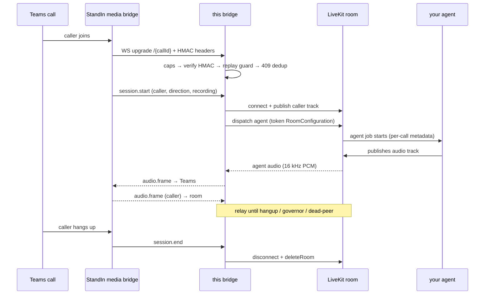

The bridge is a small, dependency-light service with three layers: a **transport** (`server.ts`) that authenticates and rate-limits the worker WebSocket, a per-call **session** (`session.ts`) that relays audio and runs the governors, and the **LiveKit side** (`livekit.ts`) that joins the room and dispatches your agent.

## Call flow



## The transport (`server.ts`)

Every worker connection is an HTTP upgrade to `/{callId}` carrying two headers: a millisecond timestamp and an HMAC-SHA256 signature over `"{timestampMs}.{callId}"`. The order of checks is deliberate:

1. **Connection caps first** (global, then per-IP) - a flood is rejected *before* any crypto runs.
2. **`callId` decode** - a malformed percent-escape can't crash the pre-auth handler (it is caught and treated as no callId).
3. **HMAC freshness + verify** - the timestamp must be within `HMAC_FRESHNESS_MS`, then the signature is checked in constant time.
4. **Replay guard** - the `(callId, ts, sig)` tuple is single-use within the freshness window, so a captured handshake can't be replayed.
5. **Duplicate 409** - if a live session already owns this `callId`, the new upgrade is rejected rather than spinning up a second billed agent.

Connection slots are claimed **before** the async upgrade completes, so a burst of simultaneous upgrades cannot transiently exceed the caps, and they are released exactly once whether the socket is adopted or dies early.

## The session (`session.ts`)

One `CallSession` pairs the worker WebSocket with one `AgentRoomPort`. Caller `audio.frame`s go to the room; agent audio comes back and is framed to the worker. While the room is still connecting, caller audio and context are buffered (bounded) so the caller's first words are not lost.

Robustness details worth knowing:

- **Backpressure** - if the worker send buffer grows past its cap, only bulky realtime frames (`audio.frame`, `display.image`) are dropped; control frames (`session.end`, `pong`) are always delivered.
- **Dead-peer detection** - the worker heartbeats every 30 s. If no message arrives for the idle window (default 90 s), the call is ended - a half-open TCP socket can't hold the room and the 409 lock open for hours.
- **Pre-start timeout** - a client that authenticates but never sends `session.start` is dropped; only a real `session.start` clears the timer (pings do not).

## The LiveKit side (`livekit.ts`)

For each call the bridge mints a join token (identity `msteams-bridge`, `canPublish`/`canSubscribe`/`canPublishData`). When `LIVEKIT_AGENT_NAME` is set, the token carries a `RoomConfiguration` with a `RoomAgentDispatch` - **explicit dispatch** fires when the room is first created, which is exactly one fresh room per call.

- **Caller audio in** → `AudioSource.captureFrame` (16 kHz mono). Malformed PCM (odd byte length) is rejected loudly, not silently truncated.
- **Agent audio out** → the first remote audio track is read through an `AudioStream` requesting 16 kHz mono; the SDK resamples, so the hot path stays copy-only. The pump resets if the track unpublishes and republishes (avatar track swaps, mute-cycle republish).
- **Teardown** → the call ends when the **agent** participant leaves (an avatar's separate participant flapping does not end the call), or on `Disconnected`. `room.close()` disconnects and, by default, deletes the room so the agent job ends immediately.

## Layout

```
src/
  server.ts      HTTP + WS upgrade, HMAC + replay guard, caps, SIGTERM drain
  session.ts     per-call relay: worker WS ⇄ LiveKit room, governors, dead-peer
  livekit.ts     room join, agent dispatch, AudioSource/AudioStream, data topics
  protocol.ts    worker wire types + parse/duration helpers
  hmac.ts        HMAC-SHA256("{timestampMs}.{callId}") sign/verify + freshness
  metrics.ts     Prometheus counters (/metrics)
  config.ts      env config (fail-loud numerics)
```
