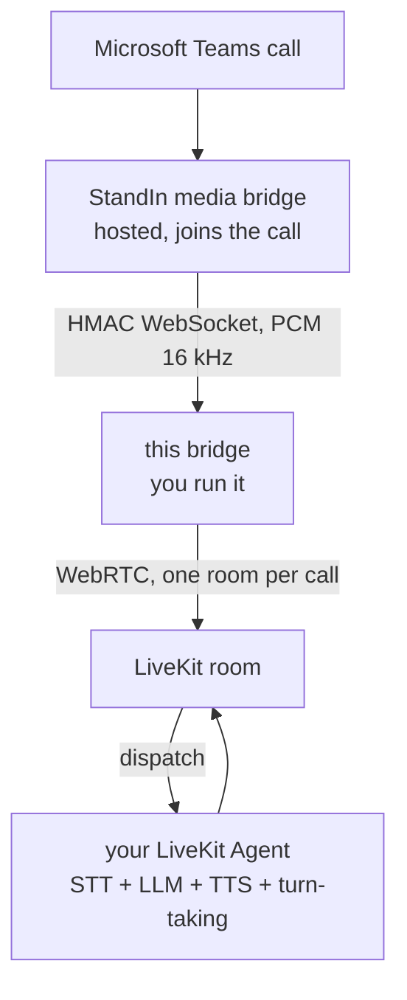

`@komaa/livekit-msteams-bridge` puts a [LiveKit Agent](https://docs.livekit.io/agents/) on a real **Microsoft Teams call** - including [avatar agents](https://github.com/livekit/agents/tree/main/examples/avatar_agents) (bitHuman, Tavus, and friends) whose voice the caller hears in Teams.

The hosted **StandIn media bridge** ([standin.komaa.com](https://standin.komaa.com)) joins the Teams call and dials into this bridge over an HMAC-authenticated WebSocket. Per call, the bridge creates **one LiveKit room**, **dispatches your agent into it** (explicit dispatch by `agentName`), joins as a participant, publishes the caller's audio, and relays the agent's audio back to Teams.

Both sides speak 16 kHz mono PCM16: the wire protocol natively, the room via the SDK's resampling `AudioSource`/`AudioStream` - the bridge itself never transcodes.

## Why this exists

Your LiveKit agent already handles WebRTC callers. This bridge lets the **same agent, unchanged**, answer a Microsoft Teams call: no Teams SDK, no Graph calls, no media stack. StandIn owns the Teams side; you own your agent; this small service is the seam between them.

## What you get

- **Any LiveKit agent answers Teams calls** - Python or Node, any STT/LLM/TTS/realtime plugin combo, dispatched by `agentName` with per-call metadata (caller name, tenant, direction, AAD id when known).
- **Turn-taking stays inside your agent** - VAD, interruption, and endpointing run in your LiveKit agent session exactly as they do for WebRTC users.
- **One room per call** - created at `session.start`, agent dispatched via the join token, room deleted at teardown so the agent job ends immediately.
- **Two call governors** - a StandIn-side cutoff and a bridge-side `MAX_CALL_MINUTES` hard cap.
- **Hardened transport** - replay-proof HMAC upgrade, caps before crypto, dead-peer detection, duplicate-call 409, graceful drain. See [Architecture](/livekit-msteams-bridge/architecture/).
- **Observability** - `GET /healthz` and `GET /metrics` (Prometheus text format).
